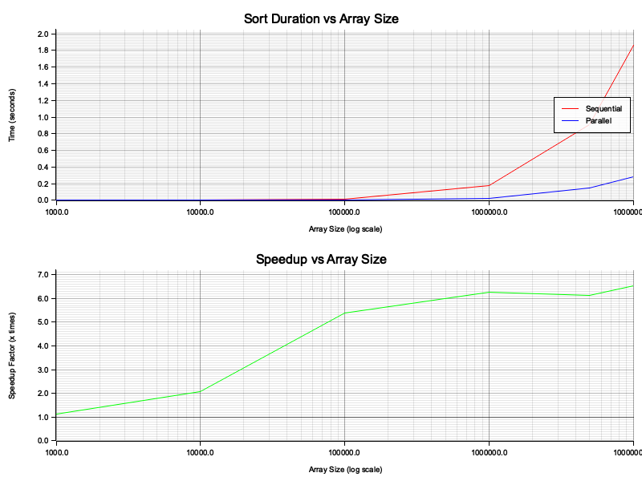

# Parallel Merge Sort Implementation in Rust

This project provides a implementation of both sequential and parallel merge sort algorithms in Rust. It demonstrates how to effectively parallelize sorting operations and includes tools to measure and compare performance.

## Project Overview

The implementation focuses on:

1. **Sequential Merge Sort**: A classic divide-and-conquer sorting algorithm
2. **Parallel Merge Sort**: A multithreaded version using Rayon library for work stealing
3. **Performance Benchmarking**: Tools to compare algorithm performance

## Algorithm Details

### Merge Sort

Merge sort is a divide-and-conquer algorithm that:
1. Divides the input array into two halves
2. Recursively sorts both halves
3. Merges the sorted halves to produce the final sorted array

Time complexity: O(n log n) for all cases.
Space complexity: O(n) for auxiliary space.

### Parallel Implementation

The parallel implementation uses Rayon's work-stealing scheduler to efficiently distribute sorting tasks across available CPU cores. Key features:

- **Threshold-Based Parallelization**: Small arrays are sorted sequentially to avoid the overhead of spawning threads for small tasks
- **Work Stealing**: The Rayon library ensures balanced work distribution across threads
- **Thread Safety**: Implementation ensures thread safety with proper sync primitives

## Project Structure

```
parallel_sort/
├── Cargo.toml        # Project dependencies
├── src/
│   ├── lib.rs        # Core algorithm implementations
│   ├── main.rs       # Benchmarking executable
│   └── benchmark.rs  # Performance benchmarking tools
├── docs/
│   └── algorithm_details.md  # Detailed algorithm explanation
├── results/
│   └── merge_sort_benchmark.png  # Benchmark visualization
└── README.md         # This documentation
```

## Implementation Details

### Sequential Merge Sort

The sequential implementation follows the classic merge sort algorithm:
- Recursively split the array until individual elements
- Merge back in sorted order

### Parallel Merge Sort

The parallel version enhances the classic algorithm by:
- Using parallel execution for the recursive sorting of sub-arrays
- Setting a threshold to switch to sequential sort for small arrays
- Using Rayon's join mechanism for efficient threading

### Optimizations

1. **Sequential Threshold**: Arrays smaller than 4096 elements are sorted sequentially to avoid parallelization overhead
2. **Memory Management**: Uses pre-allocated vectors to reduce allocation overhead
3. **Balanced Thread Load**: Rayon's work-stealing queue ensures efficient CPU utilization

## Usage

Build and run the project with Cargo:

```bash
# Run single benchmark with default or specified array size
cargo run --release [ARRAY_SIZE] [MAX_VALUE]

# Run comprehensive benchmark suite with multiple array sizes
cargo run --release -- --benchmark

# Show help message
cargo run --release -- --help
```

Arguments:
- `ARRAY_SIZE`: Number of elements to sort (default: 1,000,000)
- `MAX_VALUE`: Maximum random value to generate (default: 1,000,000)

## Example Output 

Single Run 

```bash
$ cargo run --release -- 100000
Finished release [optimized] target(s) in 0.07s
Running `target/release/parallel_sort 100000`

Benchmarking Merge Sort with array size: 100000
Generating random data...
Running sequential merge sort...
Running parallel merge sort...

Performance Comparison:
Sequential Merge Sort: 0.019914 seconds
Parallel Merge Sort: 0.003807 seconds
Speedup: 5.23x
Results are identical ✓

First 10 elements of sorted array:
7 24 26 40 42 46 49 51 58 76
```

Full Benchmark Suite

```bash
$ cargo run --release -- --benchmark
Running comprehensive benchmark suite...
Testing array sizes: [1000, 10000, 100000, 1000000, 5000000, 10000000]
Runs per size: 3

Size        | Sequential   | Parallel     | Speedup
----------------------------------------------------------
Size:      1000 | Sequential:   0.000 s | Parallel:   0.000 s | Speedup: 1.11x
Size:     10000 | Sequential:   0.002 s | Parallel:   0.001 s | Speedup: 2.07x
Size:    100000 | Sequential:   0.016 s | Parallel:   0.003 s | Speedup: 5.38x
Size:   1000000 | Sequential:   0.176 s | Parallel:   0.028 s | Speedup: 6.24x
Size:   5000000 | Sequential:   0.908 s | Parallel:   0.148 s | Speedup: 6.12x
Size:  10000000 | Sequential:   1.863 s | Parallel:   0.285 s | Speedup: 6.53x

Generating performance graphs...
Benchmark graphs saved to results/merge_sort_benchmark.png.
```


## Performance Analysis

The benchmark compares:
- Execution time of sequential vs. parallel implementation
- Speedup factor gained through parallelization
- Verification that both algorithms produce identical results

The results show impressive speedups, especially for larger arrays:
- Small arrays (1,000 elements): ~1.1× speedup
- Medium arrays (100,000 elements): ~5.4× speedup
-	Large arrays (10,000,000 elements): ~6.5× speedup

The full benchmark generates a performance graph at `results/merge_sort_benchmark.png` showing:



- Sort duration comparison between sequential and parallel implementations
- Speedup factor across different array sizes

Expected results on multi-core systems:
- Linear speedup on small to medium-sized arrays
- Diminishing returns for very large arrays due to memory bandwidth limitations

## Benchmark Results

When running the benchmark suite, performance metrics are displayed in the console and a visualization is generated at `results/merge_sort_benchmark.png`. This visualization includes:

1. A chart comparing sequential and parallel sorting times
2. A chart showing the speedup factor for different array sizes

The benchmark runs multiple iterations for each array size to ensure accurate results.

## Dependencies

- **rayon (1.7.0)**: Work-stealing parallelism library
- **rand (0.8.5)**: Random number generation for test data
- **plotters (0.3.5)**: Visualization of benchmark results

## Development Practices

The code follows production-level practices:
- Generic implementations to work with any Ord + Copy types
- Proper error handling and result validation
- Comprehensive documentation
- Performance metrics collection 
